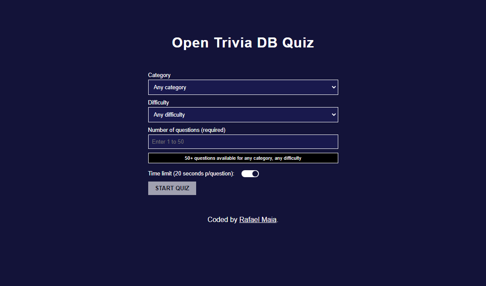
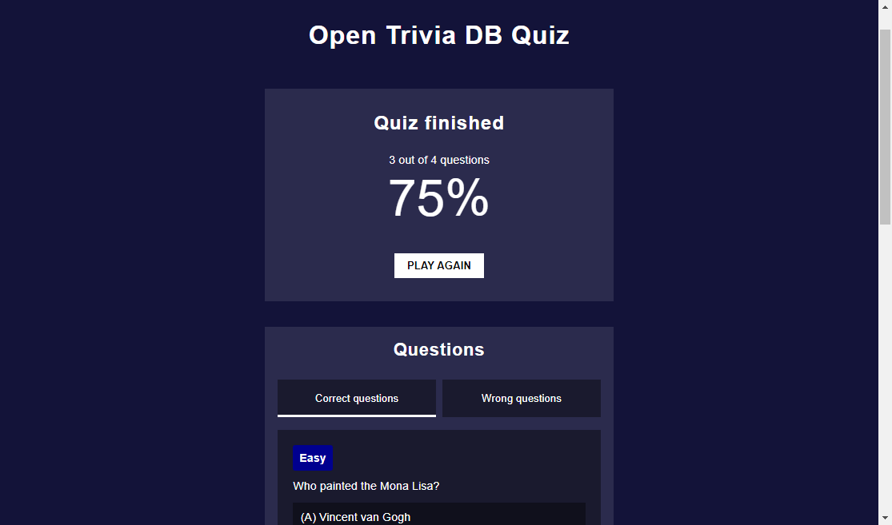

# Quiz App

A simple quiz made with questions provided by the Open Trivia DB API

## Table of Contents

- [Overview](#overview)
  - [Screenshot](#screenshot)
  - [Links](#links)
- [App](#app)
  - [Built with](#built-with)
  - [API used](#api-used)
  - [Idea](#idea)
  - [Fetching](#fetching)
  - [Accessibility](#accessibility)
- [Useful resources](#useful-resources)

## Overview

### Screenshot





### Links

- [Live site](https://rafaeldevvv.github.io/open-trivia-quiz)

## App

### Built with

- HTML
- CSS
- SASS/SCSS
- JavaScript
- React
- JSX
- Webpack
- Git/GitHub

### API-used

The API used for this quiz was the [Open Trivia DB API](https://opentdb.com/). It's fairly simple to use and pretty straightforward.

### Idea

The quiz consists of three states: choosing(selecting difficulty, category and so on), playing(answering questions) and finished(all questions are answered).

When the quiz is in its "choosing" state, the user can select the category of the questions, the difficulty, the number of questions and they can toggle the time limit.

Then the user answers the questions. And then, when all questions have been answered, the screen is updated to show how many questions the user got right and the percentage. There's also a tabbed interface for the user to see the correct and wrong questions.

### Fetching

I put all the fetch-related functions inside one file for better organization and I didn't use a custom Hook because I didn't want to take a general approach for fetching as I would use it just once anyway.

```js
import decodeQuestion from "./decodeQuestion";

export async function fetchCategories() {
  const res = await fetch("https://opentdb.com/api_category.php");
  if (res.status > 299) {
    throw new Error(
      `Failed to fetch categories. Please, try reloading the page. ${res.status} ${res.statusText}`
    );
  }

  const categoriesJSON = await res.json();
  const categories = categoriesJSON.trivia_categories;
  return categories;
}

export async function fetchQuestionCount(categoryId) {
  const response = await fetch(
    `https://opentdb.com/api_count.php?category=${categoryId}`
  );

  let data;
  if (response.status <= 299) {
    data = await response.json();
  } else {
    throw new Error(
      "Failed to fetch question count for category with id " + categoryId
    );
  }

  const questionCount = data.category_question_count;

  return {
    categoryId: categoryId,
    count: {
      total: questionCount.total_question_count,
      easy: questionCount.total_easy_question_count,
      medium: questionCount.total_medium_question_count,
      hard: questionCount.total_hard_question_count,
    },
  };
}

export async function fetchQuestionCounts(categories) {
  const questionCounts = await Promise.all(
    categories.map((category) => fetchQuestionCount(category.id))
  );
  return questionCounts;
}

export function fetchQuestions(amount, categoryId, difficulty) {
  const categoryQuery = categoryId ? `&category=${categoryId}` : "";
  const difficultyQuery = difficulty ? `&difficulty=${difficulty}` : "";

  return fetch(
    `https://opentdb.com/api.php?amount=${amount}&encode=url3986${categoryQuery}${difficultyQuery}`
  )
    .then((res) => {
      if (res.status >= 300) {
        throw new Error(
          `Failed to fetch questions. ${res.status} ${res.statusText}`
        );
      } else {
        return res.json();
      }
    })
    .then((data) => {
      if (data.response_code !== 0)
        throw new Error(
          `API returned ${data.response_code} code. Invalid parameters or no results for your query.`
        );
      else return data.results.map(decodeQuestion);
    });
}
```

### Accessibility

I want to highlight the accessibility of this project because it was the project I've been most concerned about accessibility so far, together with [my portfolio](https://rafaeldevvv.github.io/portfolio).

All controls are usable by the keyboard and I used WAI-ARIA attributes very well to give the content missing semantics. I also payed attention to the contrast of the colors.

The two custom controls that I made in this project are the toggle button for the time limit and a tabbed interface to see the correct and wrong questions. Both are usable by the keyboard and screen reader users.

I tested my application thoroughly with [NVDA](https://www.nvaccess.org/download/).

For the toggle, I just used the native checkbox as the button to be clicked and focused. I didn't use `<div>`s or `<span>`s and WAI-ARIA attributes. I just took advantage of the built-in HTML features.

The checkbox is visually hidden, but it can be focused by keyboard and screen readers. For mouse users, they just have to click the label and that's it.

```jsx
import React, { useState } from "react";

export default function CheckboxToggle({
  checked,
  id,
  onToggle,
  label,
  srWarning,
}) {
  const [isFocused, setIsFocused] = useState(false);

  let buttonClassName = "checkbox-toggle-button";
  if (checked) buttonClassName += " active";
  if (isFocused) buttonClassName += " focused";

  return (
    <label
      className="checkbox-toggle-label flex align-center gap-1"
      htmlFor={id}
    >
      {label}
      {srWarning && <span className="sr-only">{srWarning}</span>}
      <input
        type="checkbox"
        id={id}
        onChange={(e) => {
          onToggle(e.target.checked);
        }}
        checked={checked}
        className="sr-only"
        onFocus={() => setIsFocused(true)}
        onBlur={() => setIsFocused(false)}
      />
      <span
        type="button"
        aria-hidden="true"
        tabIndex="-1"
        className={buttonClassName}
        onKeyDown={(e) => {
          if (e.key.indexOf(" ") !== -1) {
            onToggle(!checked);
            e.preventDefault();
            e.stopPropagation();
          }
        }}
      >
        <span className="checkbox-toggle-ball"></span>
      </span>
    </label>
  );
}
```

The tabbed interface is a lot more complex with a lot of WAI-ARIA attributes, and I managed to build it.

```jsx
<div className="tabs" aria-label="Question Tabs">
  <Tablist onSelectTab={setSelectedTab} selectedTab={selectedTab} />
  <TabPanels
    selectedTab={selectedTab}
    wrongQuestions={wrongQuestions}
    correctQuestions={correctQuestions}
    options={options}
  />
</div>
```

```jsx
export function Tablist({ onSelectTab, selectedTab }) {
  const isCorrectSelected = selectedTab === "correct";

  const commonAttrs = {
    role: "tab",
    "aria-setsize": "2",
  };

  const correctTabRef = useRef(null);
  const wrongTabRef = useRef(null);

  function focus(tab) {
    if (tab === "correct") {
      correctTabRef.current.focus();
    } else {
      wrongTabRef.current.focus();
    }
  }

  return (
    <div
      className="tablist"
      role="tablist"
      onKeyDown={(e) => {
        if (e.key === "ArrowRight" || e.key === "ArrowLeft") {
          const tab = isCorrectSelected ? "wrong" : "correct";
          onSelectTab(tab);
          focus(tab);
        }
      }}
    >
      <button
        className={"tab " + (isCorrectSelected ? "active-tab" : "")}
        id="correct-tab"
        aria-selected={isCorrectSelected}
        aria-posinset="1"
        aria-controls="correct-questions"
        tabIndex={isCorrectSelected ? "0" : "-1"}
        onClick={() => onSelectTab("correct")}
        {...commonAttrs}
        ref={correctTabRef}
      >
        Correct questions
      </button>

      <button
        className={"tab " + (isCorrectSelected ? "" : "active-tab")}
        id="wrong-tab"
        aria-selected={!isCorrectSelected}
        aria-posinset="2"
        aria-controls="wrong-questions"
        tabIndex={isCorrectSelected ? "-1" : "0"}
        onClick={() => onSelectTab("wrong")}
        {...commonAttrs}
        ref={wrongTabRef}
      >
        Wrong questions
      </button>
    </div>
  );
}

export function TabPanels({
  selectedTab,
  wrongQuestions,
  options,
  correctQuestions,
}) {
  const isCorrectSelected = selectedTab === "correct";

  return (
    <div className="panels">
      <div
        role="tabpanel"
        className={isCorrectSelected ? "active-panel" : ""}
        hidden={isCorrectSelected ? false : true}
        aria-labelledby="correct-tab"
        tabIndex="0"
        id="correct-questions"
      >
        <QuestionsList
          questions={correctQuestions}
          options={options}
          noQuestionsText="No correct questions"
        />
      </div>
      <div
        role="tabpanel"
        className={!isCorrectSelected ? "active-panel" : ""}
        hidden={!isCorrectSelected ? false : true}
        aria-labelledby="wrong-tab"
        tabIndex="0"
        id="wrong-questions"
      >
        <QuestionsList
          questions={wrongQuestions}
          options={options}
          noQuestionsText="No wrong questions"
        />
      </div>
    </div>
  );
}

export function QuestionsList({ questions, options, noQuestionsText }) {
  const noQuestions = questions.length === 0;

  let listInner;
  if (noQuestions) {
    listInner = noQuestionsText;
  } else {
    listInner = questions.map((q) => {
      return (
        <li key={q.question} className="question">
          <QuestionDifficulty difficulty={q.difficulty} />
          <p className="question-text">{q.question}</p>
          <ul className="answer-list">
            {q.answers.map((answer, i) => {
              return (
                <li key={answer} className="answer">
                  <span className="sr-only">Option {options[i]}:</span>
                  <span aria-hidden="true">({options[i]}) </span>
                  {answer}
                </li>
              );
            })}
          </ul>
          <p className="correct-answer">
            <span>Correct answer: {q.correctAnswer}</span>
            <AnswerIcon isCorrect={true} />
          </p>
          {!checkQuestionIsCorrect(q) && (
            <p className="wrong-answer">
              <span>Your answer: {q.userAnswer}</span>
              <AnswerIcon isCorrect={false} />
            </p>
          )}
        </li>
      );
    });
  }

  return (
    <ul
      className="question-list"
      style={{ textAlign: noQuestions ? "center" : "left" }}
    >
      {listInner}
    </ul>
  );
}
```

Check out some of the useful resources below to know more about how I could make it.

## Useful resources

- [Stack Overflow - Is it okay to have form controls outside a form?](https://stackoverflow.com/questions/5385610/are-form-elements-outside-of-a-form-tag-semantic-html5)
- [Stack Exchange - How should time limits be communicated to screen reader users](https://ux.stackexchange.com/questions/98638/how-should-time-limits-be-communicated-to-screen-reader-users)
- [G133: Providing a checkbox on the first page of a multipart form that allows users to ask for longer session time limit or no session time limit](https://www.w3.org/TR/WCAG20-TECHS/G133.html)
- [Getting value of HTML Checkbox from onclick/onchange events](https://stackoverflow.com/questions/4471401/getting-value-of-html-checkbox-from-onclick-onchange-events)
- [Button inside a label](https://stackoverflow.com/questions/37504383/button-inside-a-label)
- [Icon Archive](https://www.iconarchive.com/)
- [How to structure a web form](https://developer.mozilla.org/en-US/docs/Learn/Forms/How_to_structure_a_web_form#common_html_structures_used_with_forms)
- [Screen reader reads twice when entering input in a form with aria-live="assertive" on Chrome](https://github.com/nvaccess/nvda/issues/6608)
- [tab role](https://developer.mozilla.org/en-US/docs/Web/Accessibility/ARIA/Roles/tab_role) - To built the tabbed interface

## Author

- [Rafael on Instagram](https://www.instagram.com/rafaeldevvv)
- [Rafael's portfolio](https://rafaeldevvv.github.io/portfolio)
- [Rafael on Twitter](https://www.twitter.com/rafaeldevvv)
- [Rafael on Fiverr](https://www.fiverr.com/rafael787)
- [Rafael on upwork](https://www.upwork.com/freelancers/~01a4dc9692c96839dc)
